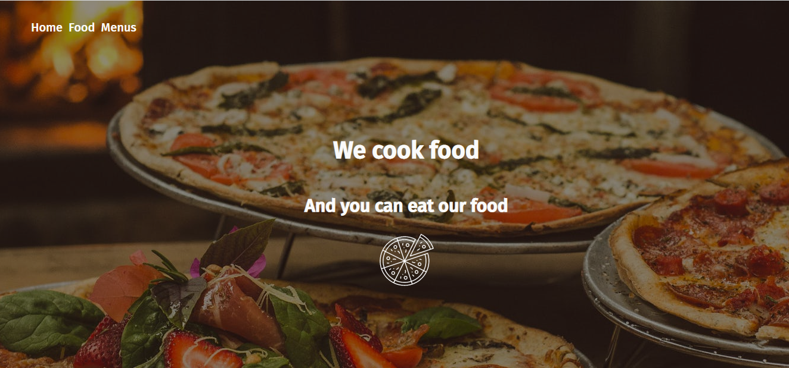

[![Contributors][contributors-shield]][contributors-url]
[![Issues][issues-shield]][issues-url]
 

  
  <h2 align="center">🍕 Restaurant App 🍕</h2>
  

  	JavaScript Project
     
    <a href="https://github.com/Fig77/Food"><strong>Explore the docs »</strong></a>
     

<!-- TABLE OF CONTENTS -->
## Table of Contents

* [About the Project](#about-the-project)
  * [Built With](#built-with)
* [Installation](#installation-and-setup)
	* [Requirements](#perquisites)
* [Live Version](#live-version-and-usage)
* [Roadmap](#roadmap)
* [License](#license)
* [Contact](#contact)

<!-- ABOUT THE PROJECT -->
## About The Project 
Project is a simple restaurant web app with a landing, small menu, and about section.

### Objective
The main objective of this project is to put into use concepts of ES6, Webpack, and modularized code, by doing a small restaurant web-app.

### Built With
This project was built with: 
* JavaScript
* ESlint
* Webpack
* SASS (for grid structure)
